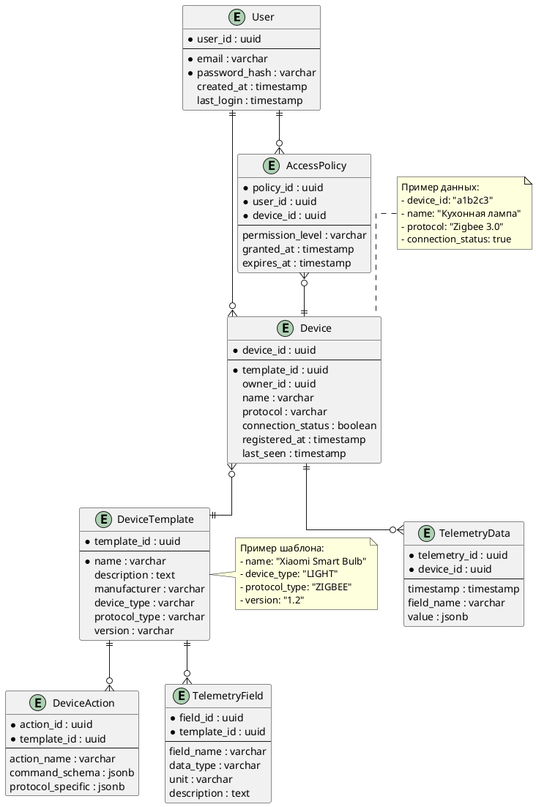

# Задание 1. Анализ и планирование


### 1. Описание функциональности монолитного приложения

- Включить / выключить систему отопления
- Установить целевую температуру для системы отопления
- Получить информацию о системе отопления 
- Получить текущую температуру 

### 2. Анализ архитектуры монолитного приложения

- **Язык программирования**: Java, Spring framework
- **База данных**: PostgreSQL
- **Архитектура**: Монолитная
- **Взаимодействие**: Синхронное, HTTP запросы обрабатываются последовательно. Используется REST
- **Масштабируемость**: Ограничена, так как монолит сложно масштабировать по частям.


### 3. Определение доменов и границы контекстов текущего решения

- Домен тепловых датчиков
- Домен управления отоплением

### **4. Проблемы текущего монолитного решения**

**У текущего решения есть ряд недостатков**: 
- Нет возможности масштабировать отдельные компоненты системы. 
- Нет возможности заведения системы отопления через интерфейс
- При появлении новой функциональности сложно следить за зависимостями.
- При увеличении команды сложно разделять ответсвенности и развивать систему из-за конфлкитов.
- Единая точка отказа

**Но также есть и преимущества**:
- Проще следить за состоянием системы 
- Нет проблем с консистентностью 
- Меньше задержек из-за сетевых вызовов
- Проще организована инфраструктура

**Вывод**:

В данном случае, когда в команде разработки 5 человек, а рост числа кли имеет смысл остановиться на монолитном варианте архитектуры, но использовать подходы DDD и feature-sliced, Onion архитектуры для разделения зависимостей между компонентами системы, чтобы в будущем было проще вынести микросервисы. Также это называют модульным монолитом. Но также при выборе между модульным монолитом и микросервисами стоит учитывать планируемую нагрузку, после внедрения решения во все поселки. 

### 5. Визуализация контекста системы — диаграмма С4

```plantuml
@startuml
title Old smart home Context Diagram

top to bottom direction

!includeurl https://raw.githubusercontent.com/RicardoNiepel/C4-PlantUML/master/C4_Component.puml

Person(user, "User", "A user of the smart home system")

System(SmartHomeSystem, "SmartHome System", "System manage heating system control (turn on, turn off, set desire temperature and get current temperature)")

Rel(user, SmartHomeSystem, "Uses the system")

@enduml
```

# Задание 2. Проектирование микросервисной архитектуры

В этом задании вам нужно предоставить только диаграммы в модели C4. Мы не просим вас отдельно описывать получившиеся микросервисы и то, как вы определили взаимодействия между компонентами To-Be системы. Если вы правильно подготовите диаграммы C4, они и так это покажут.

**Диаграмма контейнеров (Containers)**

```plantuml
@startuml
title SmartHome Container Diagram

top to bottom direction

!includeurl https://raw.githubusercontent.com/RicardoNiepel/C4-PlantUML/master/C4_Component.puml

Person(user, "User", "A user of the smart home system")
Person(support, "Technical Support", "An technical support specialist")

Container_Boundary(SmartHomeSystem, "SmartHome System") {
  Container(ApiGateway, "Api gateway", "Java, Spring", "Accept HTTP client request, logging, routing, authorization")
  Container(DeviceManager, "Device Manager", "Java, Spring", "Store device metadata and device templates with commands, accept user commands")
  Container(IdentityService, "Identity Service", "Java, Spring", "Authentication and authorization logic")
  Container(DeviceProtocolAdapter, "Device Protocol Adapter", "Java, Spring", "Accept abstract command and convert for specific device protocol")
  Container(AutomationService, "Automation Service", "Java, Spring", "Stores and execute user automation scenarios")
  Container(TelemetryService, "Telemetry Service", "Java, Spring", "Accept telemetry data and store it")
  Container_Ext(Kafka, "Event Bus", "Kafka", "Store events for async interaction.")
}

Rel(user, ApiGateway, "Manage smart home")
Rel(support, ApiGateway, "Add device templates, edit data")

Rel(ApiGateway, IdentityService, "Register user / Get user info and authorize it")
Rel(ApiGateway, DeviceManager, "Register device, send commands")
Rel(ApiGateway, AutomationService, "Add automation scenario")
Rel(ApiGateway, TelemetryService, "Get telemetry info")

Rel(DeviceManager, Kafka, "User device commands")

Rel(Kafka, DeviceProtocolAdapter, "User device commands")
Rel(DeviceProtocolAdapter, Kafka, "Telemetry data")
Rel(Kafka, TelemetryService, "Consume and store telemetry data")
Rel(AutomationService, Kafka, "Automation command")

@enduml
```

**Диаграмма компонентов (Components)**

#### Диаграмма компонента Device Manager
```plantuml
@startuml
title SmartHome Device Manager Component Diagram

top to bottom direction

!includeurl https://raw.githubusercontent.com/RicardoNiepel/C4-PlantUML/master/C4_Component.puml

Person(user, "User", "A user of the smart home system")
Person(support, "Technical Support", "An technical support specialist")

Container_Boundary(SmartHomeSystem, "SmartHome System") {
  Container(ApiGateway, "Api gateway", "Java, Spring", "Accept HTTP client request, logging, routing, authorization")
  Container(DeviceManager, "Device Manager", "Java, Spring", "Store device metadata and device templates with commands, accept user commands"){
    Component(DeviceController, "DeviceController", "Handles device registration")
    Component(DeviceTemplateController, "DeviceTemplateController", "Handles device template creation")
    Component(CommandController, "CommandController", "Handles user command")
    Component(KafkaPublisher, "KafkaPublisher", "Publish event with device commands")
    Component(ServiceLayer, "Service Layer", "Business logic")
    Component(RepositoryLayer, "Repository Layer", "Data access logic")
    Component(Database, "Store device data")
  }
  Container(IdentityService, "Identity Service", "Java, Spring", "Authentication and authorization logic")
  Container(DeviceProtocolAdapter, "Device Protocol Adapter", "Java, Spring", "Accept abstract command and convert for specific device protocol")
  Container(AutomationService, "Automation Service", "Java, Spring", "Stores and execute user automation scenarios")
  Container(TelemetryService, "Telemetry Service", "Java, Spring", "Accept telemetry data and store it")
  Container_Ext(Kafka, "Event Bus", "Kafka", "Store events for async interaction.")
}

Rel(user, ApiGateway, "Manage smart home")
Rel(support, ApiGateway, "Add device templates, edit data")

Rel(ApiGateway, IdentityService, "Register user / Get user info and authorize it")
Rel(ApiGateway, DeviceManager, "Register device, send commands")
Rel(ApiGateway, AutomationService, "Add automation scenario")
Rel(ApiGateway, TelemetryService, "Get telemetry info")

Rel(DeviceManager, Kafka, "User device commands")

Rel(Kafka, DeviceProtocolAdapter, "User device commands")
Rel(DeviceProtocolAdapter, Kafka, "Telemetry data")
Rel(Kafka, TelemetryService, "Consume and store telemetry data")
Rel(AutomationService, Kafka, "Automation command")

Rel(DeviceController,ServiceLayer,"Calls buisness logic")
Rel(DeviceTemplateController,ServiceLayer,"Calls buisness logic")
Rel(CommandController,ServiceLayer,"Calls buisness logic")
Rel(ServiceLayer,RepositoryLayer,"Read/write data")
Rel(ServiceLayer,KafkaPublisher,"Publish command event")
Rel(RepositoryLayer,Database,"Read/write data")

@enduml
```

#### Диаграмма компонента Identity Service
```plantuml
@startuml
title SmartHome Identity Service Component Diagram

top to bottom direction

!includeurl https://raw.githubusercontent.com/RicardoNiepel/C4-PlantUML/master/C4_Component.puml

Person(user, "User", "A user of the smart home system")
Person(support, "Technical Support", "An technical support specialist")

Container_Boundary(SmartHomeSystem, "SmartHome System") {
  Container(ApiGateway, "Api gateway", "Java, Spring", "Accept HTTP client request, logging, routing, authorization")
  Container(DeviceManager, "Device Manager", "Java, Spring", "Store device metadata and device templates with commands, accept user commands")
  Container(IdentityService, "Identity Service", "Java, Spring", "Authentication and authorization logic"){
    Component(AuthController, "AuthController", "Handles user registration or authentication")
    Component(ServiceLayer, "Service Layer", "Business logic")
    Component(RepositoryLayer, "Repository Layer", "Data access logic")
    Component(Database, "Store user data")

  }
  Container(DeviceProtocolAdapter, "Device Protocol Adapter", "Java, Spring", "Accept abstract command and convert for specific device protocol")
  Container(AutomationService, "Automation Service", "Java, Spring", "Stores and execute user automation scenarios")
  Container(TelemetryService, "Telemetry Service", "Java, Spring", "Accept telemetry data and store it")
  Container_Ext(Kafka, "Event Bus", "Kafka", "Store events for async interaction.")
}

Rel(user, ApiGateway, "Manage smart home")
Rel(support, ApiGateway, "Add device templates, edit data")

Rel(ApiGateway, IdentityService, "Register user / Get user info and authorize it")
Rel(ApiGateway, DeviceManager, "Register device, send commands")
Rel(ApiGateway, AutomationService, "Add automation scenario")
Rel(ApiGateway, TelemetryService, "Get telemetry info")

Rel(DeviceManager, Kafka, "User device commands")

Rel(Kafka, DeviceProtocolAdapter, "User device commands")
Rel(DeviceProtocolAdapter, Kafka, "Telemetry data")
Rel(Kafka, TelemetryService, "Consume and store telemetry data")
Rel(AutomationService, Kafka, "Automation command")

Rel(AuthController,ServiceLayer,"Calls buisness logic")
Rel(ServiceLayer,RepositoryLayer,"Read/write data")
Rel(RepositoryLayer,Database,"Read/write data")

@enduml
```
#### Диаграмма компонента Device Protocol Adapter

```plantuml
@startuml
title SmartHome Device Protocol Adapter Component Diagram

top to bottom direction

!includeurl https://raw.githubusercontent.com/RicardoNiepel/C4-PlantUML/master/C4_Component.puml

Person(user, "User", "A user of the smart home system")
Person(support, "Technical Support", "An technical support specialist")

Container_Boundary(SmartHomeSystem, "SmartHome System") {
  Container(ApiGateway, "Api gateway", "Java, Spring", "Accept HTTP client request, logging, routing, authorization")
  Container(DeviceManager, "Device Manager", "Java, Spring", "Store device metadata and device templates with commands, accept user commands")
  Container(IdentityService, "Identity Service", "Java, Spring", "Authentication and authorization logic")
  Container(DeviceProtocolAdapter, "Device Protocol Adapter", "Java, Spring", "Accept abstract command and convert for specific device protocol"){
    Component(KafkaConsumer, "KafkaConsumer", "Handle command message and execute them")
    Component(KafkaProducer, "KafkaProducer", "Produce messages with telemetry info")
    Component(ServiceLayer, "Service Layer", "Business logic")
  }
  Container(AutomationService, "Automation Service", "Java, Spring", "Stores and execute user automation scenarios")
  Container(TelemetryService, "Telemetry Service", "Java, Spring", "Accept telemetry data and store it")
  Container_Ext(Kafka, "Event Bus", "Kafka", "Store events for async interaction.")
}

Rel(user, ApiGateway, "Manage smart home")
Rel(support, ApiGateway, "Add device templates, edit data")

Rel(ApiGateway, IdentityService, "Register user / Get user info and authorize it")
Rel(ApiGateway, DeviceManager, "Register device, send commands")
Rel(ApiGateway, AutomationService, "Add automation scenario")
Rel(ApiGateway, TelemetryService, "Get telemetry info")

Rel(DeviceManager, Kafka, "User device commands")

Rel(Kafka, DeviceProtocolAdapter, "User device commands")
Rel(DeviceProtocolAdapter, Kafka, "Telemetry data")
Rel(Kafka, TelemetryService, "Consume and store telemetry data")
Rel(AutomationService, Kafka, "Automation command")

Rel(KafkaConsumer,ServiceLayer,"Calls buisness logic")
Rel(ServiceLayer,KafkaProducer,"Produce telemetry data")

@enduml
```

#### Диаграмма компонента Automation Service

```plantuml
@startuml
title SmartHome Automation Service Component Diagram

top to bottom direction

!includeurl https://raw.githubusercontent.com/RicardoNiepel/C4-PlantUML/master/C4_Component.puml

Person(user, "User", "A user of the smart home system")
Person(support, "Technical Support", "An technical support specialist")

Container_Boundary(SmartHomeSystem, "SmartHome System") {
  Container(ApiGateway, "Api gateway", "Java, Spring", "Accept HTTP client request, logging, routing, authorization")
  Container(DeviceManager, "Device Manager", "Java, Spring", "Store device metadata and device templates with commands, accept user commands")
  Container(IdentityService, "Identity Service", "Java, Spring", "Authentication and authorization logic")
  Container(DeviceProtocolAdapter, "Device Protocol Adapter", "Java, Spring", "Accept abstract command and convert for specific device protocol")
  Container(AutomationService, "Automation Service", "Java, Spring", "Stores and execute user automation scenarios"){
    Component(AutomationScenarioController, "AutomationScenarioController", "Handle custom user automation scenario")
    Component(ServiceLayer, "Service Layer", "Business logic")
    Component(RepositoryLayer, "Repository Layer", "Data access logic")
    Component(Database, "Store automation scenarios")
    Component(KafkaProducer, "Produce commands")
    Component(KafkaConsumer, "Consume telemetry data from devices")
  }
  Container(TelemetryService, "Telemetry Service", "Java, Spring", "Accept telemetry data and store it")
  Container_Ext(Kafka, "Event Bus", "Kafka", "Store events for async interaction.")
}

Rel(user, ApiGateway, "Manage smart home")
Rel(support, ApiGateway, "Add device templates, edit data")

Rel(ApiGateway, IdentityService, "Register user / Get user info and authorize it")
Rel(ApiGateway, DeviceManager, "Register device, send commands")
Rel(ApiGateway, AutomationService, "Add automation scenario")
Rel(ApiGateway, TelemetryService, "Get telemetry info")

Rel(DeviceManager, Kafka, "User device commands")

Rel(Kafka, DeviceProtocolAdapter, "User device commands")
Rel(DeviceProtocolAdapter, Kafka, "Telemetry data")
Rel(Kafka, TelemetryService, "Consume and store telemetry data")
Rel(AutomationService, Kafka, "Automation command")

Rel(AutomationScenarioController,ServiceLayer,"Calls buisness logic")
Rel(ServiceLayer,RepositoryLayer,"Read/write data")
Rel(RepositoryLayer,Database,"Read/write data")
Rel(KafkaConsumer,ServiceLayer,"Calls buisness logic")
Rel(ServiceLayer,KafkaProducer,"Produce commands to device")

@enduml
```

#### Диаграмма компонента Telemetry Service

```plantuml
@startuml
title SmartHome Telemetry Service Component Diagram

top to bottom direction

!includeurl https://raw.githubusercontent.com/RicardoNiepel/C4-PlantUML/master/C4_Component.puml

Person(user, "User", "A user of the smart home system")
Person(support, "Technical Support", "An technical support specialist")

Container_Boundary(SmartHomeSystem, "SmartHome System") {
  Container(ApiGateway, "Api gateway", "Java, Spring", "Accept HTTP client request, logging, routing, authorization")
  Container(DeviceManager, "Device Manager", "Java, Spring", "Store device metadata and device templates with commands, accept user commands")
  Container(IdentityService, "Identity Service", "Java, Spring", "Authentication and authorization logic")
  Container(DeviceProtocolAdapter, "Device Protocol Adapter", "Java, Spring", "Accept abstract command and convert for specific device protocol")
  Container(AutomationService, "Automation Service", "Java, Spring", "Stores and execute user automation scenarios")
  Container(TelemetryService, "Telemetry Service", "Java, Spring", "Accept telemetry data and store it"){
    Component(ServiceLayer, "Service Layer", "Business logic")
    Component(RepositoryLayer, "Repository Layer", "Data access logic")
    Component(Database, "Store telemetry data")
    Component(KafkaConsumer, "Consume telemetry data from devices")
  }
  Container_Ext(Kafka, "Event Bus", "Kafka", "Store events for async interaction.")
}

Rel(user, ApiGateway, "Manage smart home")
Rel(support, ApiGateway, "Add device templates, edit data")

Rel(ApiGateway, IdentityService, "Register user / Get user info and authorize it")
Rel(ApiGateway, DeviceManager, "Register device, send commands")
Rel(ApiGateway, AutomationService, "Add automation scenario")
Rel(ApiGateway, TelemetryService, "Get telemetry info")

Rel(DeviceManager, Kafka, "User device commands")

Rel(Kafka, DeviceProtocolAdapter, "User device commands")
Rel(DeviceProtocolAdapter, Kafka, "Telemetry data")
Rel(Kafka, TelemetryService, "Consume and store telemetry data")
Rel(AutomationService, Kafka, "Automation command")

Rel(ServiceLayer,RepositoryLayer,"Read/write data")
Rel(RepositoryLayer,Database,"Read/write data")
Rel(KafkaConsumer,ServiceLayer,"Calls buisness logic")

@enduml
```

**Диаграмма кода (Code)**

```plantuml
@startuml
title Smart Home Device Manager Code Diagram

top to bottom direction

!includeurl https://raw.githubusercontent.com/RicardoNiepel/C4-PlantUML/master/C4_Component.puml

class DeviceManagerService {
  +string ServiceName
  +string Version
  +void RegisterDevice(Device device)
  +void AddTemplate(DeviceTemplate template)
  +DeviceTemplate GetTemplate(string templateId)
  +List<Device> GetUserDevices(string userId)
}

class Device {
  +string DeviceId
  +string TemplateId
  +DeviceStatus Status
  +Dictionary<string, string> CustomProperties
  +void ApplyCommand(string command, object payload)
}

class DeviceTemplate {
  +string TemplateId
  +string DeviceType
  +string Protocol
  +string Manufacturer
  +string Version
  +List<DeviceAction> SupportedActions
  +List<TelemetryField> TelemetrySchema
  +void ValidateConfiguration()
}

class DeviceAction {
  +string Name
  +string Description
  +Dictionary<string, Type> Parameters
  +string ProtocolConfiguration
}

class TelemetryField {
  +string FieldName
  +string Description
  +DataType Type
  +string SourcePath
}

class DeviceStatus {
  +bool IsOnline
  +DateTime LastSeen
  +string LastError
  +void UpdateStatus(bool isOnline)
}

enum DeviceType {
  LIGHT
  THERMOSTAT
  CAMERA
  LOCK
}

enum ProtocolType {
  MQTT
  ZIGBEE
  HTTP
  ZWAVE
}

enum DataType {
  STRING
  INTEGER
  BOOLEAN
  FLOAT
}

DeviceManagerService "1" -- "0..*" Device
DeviceManagerService "1" -- "0..*" DeviceTemplate
Device "1" -- "1" DeviceStatus
Device "1" -- "1" DeviceTemplate
DeviceTemplate "1" -- "1..*" DeviceAction
DeviceTemplate "1" -- "1..*" TelemetryField
DeviceTemplate "1" -- "1" DeviceType
DeviceTemplate "1" -- "1" ProtocolType
TelemetryField "1" -- "1" DataType

note right of DeviceTemplate
  Пример шаблона для Zigbee-лампы:
  - Actions: turn_on, turn_off
  - Telemetry: brightness, power_usage
  - Protocol: Zigbee 3.0
  - Manufacturer: Xiaomi
end note

@enduml
```

# Задание 3. Разработка ER-диаграммы



# ❌ Задание 4. Создание и документирование API
